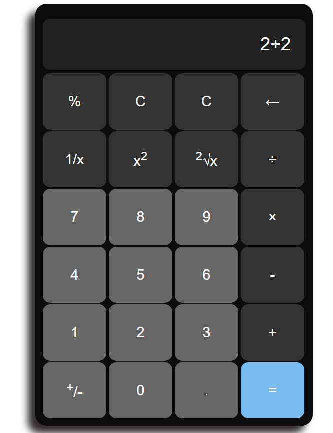

# Calculator Web App



Simple Calculator Web App.

## Description

This is a simple calculator web app designed to perform basic arithmetic operations such as addition, subtraction, multiplication, and division. The app features a user-friendly interface with buttons for digits, operations, and a display area to show results. Users can input numbers and select operations, and the app will calculate the result in real time. It also includes functionality to clear inputs, handle decimal points, and ensure that calculations are accurate. Ideal for users looking for a quick and easy tool to perform everyday calculations directly in their browser.

## Getting Started

### Dependencies

- A modern web browser (e.g., Google Chrome, Firefox, Edge)
- No special libraries or frameworks are required
- Operating system: Windows, Mac, or Linux

### Installing

1. Clone or download the repository to your local machine:

```sh
git clone https://github.com/Ashutosh-88/-Simple--CalculatorWebApp
```

2. Navigate to the project folder in your terminal:

```sh
cd -Simple--CalculatorWebApp
```

3. Open the `index.html` file in your web browser.

### Executing Program

1. To open the app, simply open the `index.html` file in your browser.
2. The app displays a simple user interface with buttons for digits (0-9), basic operations (+, -, \*, /), a Backspace button (<--), a clear button (C), and an equals button (=).
3. Click on the number buttons to input digits into the display area.
4. Choose an arithmetic operation (e.g., +, -, \*, /) by clicking the respective button.
5. After entering the numbers and selecting an operation, press the equals button (=) to calculate the result.
6. If needed, press the backspace button (<--) to clear the latest entered value one after another or press the clear button (C) to reset the input and start over.
7. The app allows you to continue performing calculations as needed until you decide to close the app.

## Help

If you run into any issues, ensure you are using a compatible browser and that JavaScript is enabled. If you need more help, please check the browser console for any error messages.

## Authors

- [Ashutosh Tiwari](https://www.linkedin.com/in/ashutosh-tiwari-70b504190/)

## Version History

- 0.1
  - Initial Release

## License

This project is licensed under the [MIT License](https://opensource.org/licenses/MIT) - see the LICENSE.md file for details.
